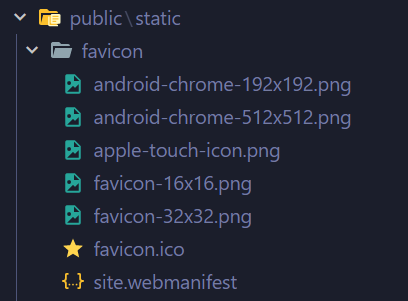
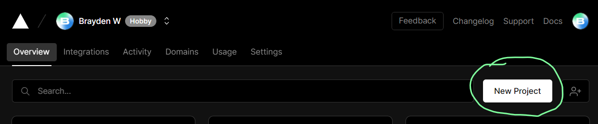

## Setup

First, clone this repository.

```
git clone https://github.com/<--USER-->/<--REPO-->
cd <--FOLDER-NAME-->
```

### Install the dependencies

Ba-da-boom! Your code is all there.... however you need to install dependencies like React, NextJS, and TailwindCSS into your project so the stuff actually works! Do so by installing them with the package manager of your choice:

```bash
# NPM
npm i

# Yarn
yarn
```

### Edit content

Now, before you run it locally, you should edit the content first!

To do so, open the `data/config.js` file and edit the values to what makes you, you!

Also, replace the image located in `public/static/profile.png` with a picture of yourself! Or a cool avatar! Or just keep it the same if you are actually LeBron James! (Hey LeBron if you're looking at this, then "hello world" to you!)

### Change the Favicon

So... you want to change that icon that shows up on your browser tab for your portfolio? (aka: A "Favicon")

Follow these steps:

1. Create your logo and download it on your computer
2. Go to a favicon generator site like [favicon.io](https://favicon.io), go through the steps to get you icon files.
3. Place those files in the `public/static/favicon/` like so:

    

Then it should be ready!

## Try it out!

### Run locally!

To see it in action in your browser, run the `dev` script:

```bash
# NPM
npm run dev

# Yarn
yarn dev
```

**_Ta-da!_** 🎉

### Deploy onto a live website!

Now, how do you get this published for all the world to see? [Vercel](https://vercel.com) is an awesome and 100% free option for this. 

Signup for free with your Github account and click the "New Project" button on your dashboard.



Import the github repository you just created then after some loading...


You're brand new portfolio should be ready to go!

Share it with some friends, family members, employers?

---